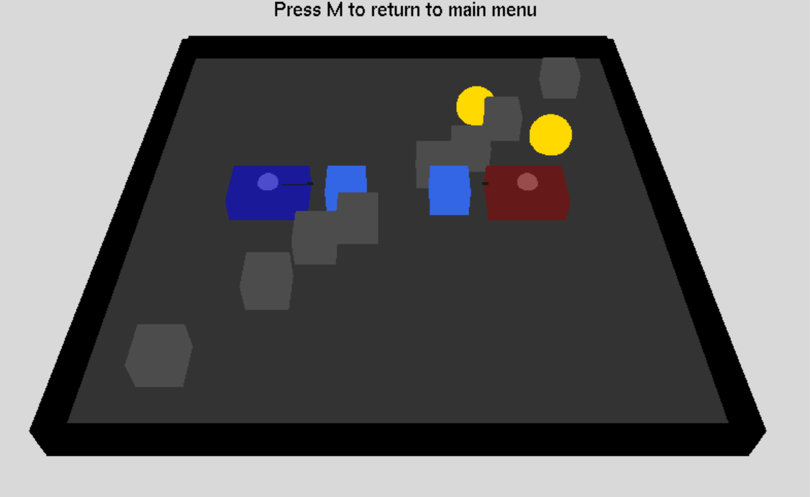

# Top-Down-Tank-Shooter

A simple 3D tank battle game built using OpenGL and GLUT in C++.  
Play against another player or a bot across multiple levels with destructible obstacles and power-ups.

## Features

- 2-player mode and single-player mode with AI opponent  
- Multiple levels with increasing difficulty  
- Tanks with health, shooting mechanics, and movement controls  
- Destructible blue obstacles and indestructible grey obstacles  
- Health power-ups (yellow objects)  
- Explosion and firework visual effects  
- Score tracking and win conditions  
- How to play instructions and main menu system  

## Controls

### Player 1  
- Move: W / A / S / D  
- Shoot: SPACE  

### Player 2  
- Move: Arrow keys  
- Shoot: ENTER  


## Installation & Running

1. Make sure you have OpenGL and GLUT installed on your system.  
2. Compile the source code with a C++ compiler. For example, using g++:

   ```bash
   g++ TankShooting.cpp -o TankGame -lGL -lGLU -lglut

## File Structure
TankShooting.cpp - Main source file with game logic and rendering

Assets and dependencies should be included or linked as necessary.

## Dependencies
- OpenGL
- GLUT (OpenGL Utility Toolkit)

## Notes
- The game uses simple shapes and basic shading for visuals.
- The AI for the bot player shoots at intervals and moves randomly.
- Feel free to modify and extend the game features!

## License
This project is open source and available under the MIT License.



